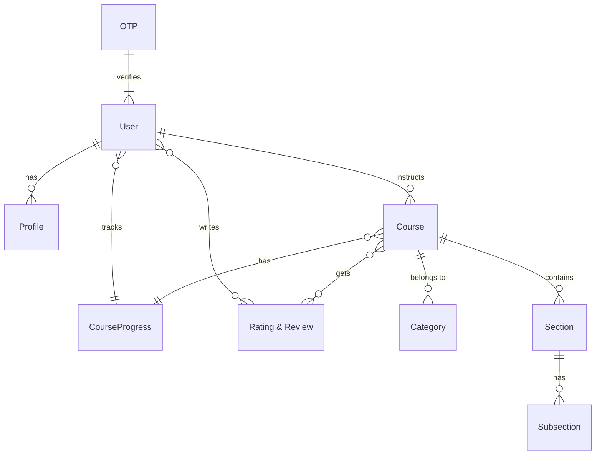

# 🚀 StudyNotion: The Ultimate Ed-Tech Platform

## Short Description
StudyNotion is a cutting-edge, full-stack educational technology platform designed to empower both learners and instructors. This comprehensive LMS (Learning Management System) facilitates seamless course creation, student enrollment, progress tracking, and secure payment processing, all wrapped in an intuitive and responsive user experience. Whether you're an educator looking to share your knowledge or a student eager to master new skills, StudyNotion provides a dynamic and engaging environment for online learning.

## ✨ Key Features
*   **Robust User Authentication:** Secure signup, login, password reset, and email verification for both students and instructors.
*   **Comprehensive Course Management:** Instructors can effortlessly create, update, delete, and publish courses with rich content, including sections, subsections, and media.
*   **Dynamic Course Catalog:** Explore a wide array of courses categorized for easy discovery and filtering.
*   **Flexible Enrollment & Payments:** Seamless course enrollment with integrated payment gateway (Razorpay) for a smooth transaction experience.
*   **Personalized Dashboards:** Dedicated dashboards for students to track their progress and enrolled courses, and for instructors to manage their courses, view analytics, and track earnings.
*   **Interactive Learning Experience:** Engage with course content, mark lecture completion, and provide ratings and reviews.
*   **Rich User Profiles:** Customizable user profiles, including profile picture uploads via Cloudinary.
*   **Responsive UI/UX:** A modern, visually appealing, and responsive interface built with Tailwind CSS.
*   **Automated Email Notifications:** System-generated emails for course enrollment, payment success, and password updates.

## Who is this for?
*   **Individual Instructors & Tutors:** To host and sell their online courses, manage student enrollments, and track performance.
*   **Students & Lifelong Learners:** To discover and enroll in high-quality courses, track their learning journey, and interact with content.
*   **Educational Institutions & Academies:** To deploy a scalable online learning platform for their students.
*   **Entrepreneurs in Ed-Tech:** A solid foundation for building and customizing a powerful e-learning solution.

## Technology Stack & Architecture
StudyNotion is built on a robust MERN stack, offering a scalable and high-performance solution.

*   **Frontend:**
    *   **React.js:** For building a dynamic and interactive user interface.
    *   **Redux Toolkit:** For efficient state management across the application.
    *   **Tailwind CSS:** For highly customizable and utility-first styling.
*   **Backend:**
    *   **Node.js & Express.js:** A powerful and flexible backend for handling API requests.
*   **Database:**
    *   **MongoDB:** A NoSQL database for flexible and scalable data storage.
*   **Cloud Services:**
    *   **Cloudinary:** For efficient cloud-based storage and delivery of media assets (images, videos).
    *   **Razorpay:** Integrated payment gateway for secure and streamlined transactions.
    *   **Nodemailer:** For sending automated email notifications.
*   **Authentication:**
    *   **JWT (JSON Web Tokens):** For secure user authentication and authorization.

## 📊 Architecture & Database Schema

Our architecture follows a clear separation of concerns, ensuring maintainability and scalability.

### High-Level Architecture
The project leverages a client-server architecture, with the React frontend communicating with the Node.js/Express backend, which in turn interacts with MongoDB and various external services.


### Database Schema (Entity-Relationship Diagram)
The database schema is designed for an efficient and interconnected learning ecosystem.



For a more detailed visual, please refer to the pre-existing schema image:


## ⚡ Quick Start Guide

To get StudyNotion up and running on your local machine, follow these steps:

1.  **Clone the Repository:**
    ```bash
    git clone https://github.com/grewal16/study_notion.git
    cd study_notion
    ```
2.  **Install Frontend Dependencies:**
    ```bash
    npm install # or yarn install
    ```
3.  **Install Backend Dependencies:**
    ```bash
    cd server
    npm install # or yarn install
    cd ..
    ```
4.  **Configure Environment Variables:**
    Create a `.env` file in the `server` directory and populate it with your specific configurations (e.g., MongoDB URI, Cloudinary credentials, Razorpay API keys, JWT secret).
5.  **Start the Backend Server:**
    ```bash
    cd server
    npm start # or node index.js
    cd ..
    ```
6.  **Start the Frontend Application:**
    ```bash
    npm start # or yarn start
    ```
    The application should now be accessible in your browser, typically at `http://localhost:3000`.
