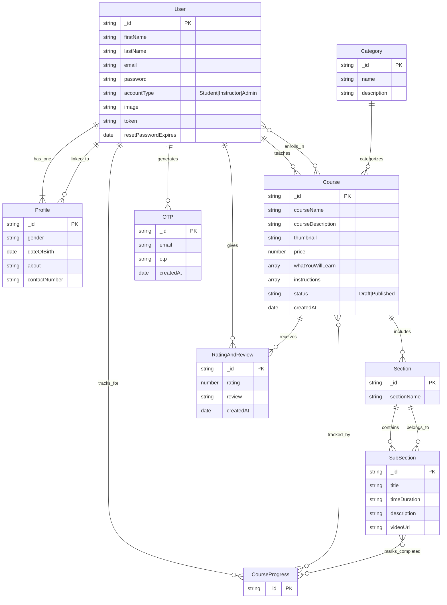

# 🚀 StudyNotion: Your All-in-One E-Learning Powerhouse

Welcome to **StudyNotion**, a cutting-edge, full-stack online learning platform designed to revolutionize education. Built with a robust MERN stack, StudyNotion empowers both students and instructors with a seamless, intuitive, and feature-rich environment to create, manage, enroll in, and consume courses. Dive into a world where learning is accessible, interactive, and tailored for success.

## Short Description

StudyNotion is a comprehensive e-learning platform enabling students to discover and enroll in a wide range of courses, while providing instructors with powerful tools to create, manage, and deliver engaging educational content. From secure authentication to integrated payments and progress tracking, StudyNotion covers every aspect of a modern online learning experience.

## ✨ Key Features

*   **Robust User Authentication & Authorization:** Secure signup, login, password reset, and OTP verification for all user types (Student, Instructor).
*   **Role-Based Dashboards:** Tailored experiences for students to track progress and enroll in courses, and for instructors to manage their curriculum and view analytics.
*   **Dynamic Course Creation & Management:** Instructors can effortlessly add, edit, and publish courses, including sections, subsections, and video lectures, complete with rich metadata and requirements.
*   **Seamless Course Enrollment:** Students can browse a diverse catalog, add courses to their cart, and enroll securely via integrated payment gateways.
*   **Interactive Learning Experience:** Track course progress, mark lectures as complete, and engage with content at your own pace.
*   **Integrated Payment Gateway:** Secure and efficient course purchases powered by Razorpay.
*   **Cloud-Based Media Management:** Leverage Cloudinary for seamless upload and delivery of course thumbnails and video content.
*   **Ratings & Reviews System:** Foster a community-driven learning environment with user-generated course ratings and reviews.
*   **Comprehensive Profile Management:** Users can update personal details, profile pictures, and manage their account settings.
*   **Automated Email Notifications:** Keep users informed with transactional emails for course enrollment, password updates, and more.
*   **Modern & Responsive UI:** Built with React and styled with Tailwind CSS for a beautiful, consistent experience across devices.

## Who is this for?

*   **Aspiring Students:** Seeking a user-friendly platform to explore new subjects, enroll in courses, and track their learning journey.
*   **Passionate Instructors:** Looking for a powerful, easy-to-use tool to share their knowledge, create engaging courses, and manage their student base.
*   **Ed-Tech Innovators:** Interested in a comprehensive foundation for building or expanding their online education initiatives.
*   **Full-Stack Developers:** Seeking a well-structured MERN stack application demonstrating best practices in authentication, state management (Redux Toolkit), and third-party integrations.

## Technology Stack & Architecture

StudyNotion is engineered with a modern, scalable MERN (MongoDB, Express.js, React, Node.js) stack, enhanced by industry-standard tools:

*   **Frontend:**
    *   **React:** For building dynamic and responsive user interfaces.
    *   **Redux Toolkit:** For efficient and predictable state management.
    *   **React Router DOM:** For seamless client-side navigation.
    *   **Tailwind CSS:** For rapid and highly customizable styling.
*   **Backend:**
    *   **Node.js & Express.js:** For building a fast and scalable RESTful API.
    *   **MongoDB (Mongoose ODM):** As the NoSQL database for flexible data storage.
    *   **JWT (JSON Web Tokens):** For secure, stateless authentication.
    *   **Bcrypt:** For hashing passwords securely.
*   **Cloud Services:**
    *   **Cloudinary:** For efficient cloud-based image and video hosting.
    *   **Nodemailer:** For sending transactional emails.
*   **Payment Gateway:**
    *   **Razorpay:** Integrated for secure online payment processing.

## 📊 Architecture & Database Schema

The core architecture follows a client-server model, with a React frontend interacting with a Node.js/Express.js backend. Data is persisted in a MongoDB database, with relationships managed through Mongoose.

The database schema is designed for an e-learning application, incorporating users, courses, categories, sections, lectures (sub-sections), progress tracking, ratings, and more.



## ⚡ Quick Start Guide

To get StudyNotion up and running on your local machine, follow these steps:

1.  **Clone the Repository:**
    ```bash
    git clone https://github.com/grewal16/study_notion.git
    cd study_notion
    ```

2.  **Backend Setup:**
    ```bash
    cd server
    npm install
    npm start
    ```
    *   **Environment Variables:** Create a `.env` file in the `server` directory and populate it with your MongoDB URI, Cloudinary credentials, Razorpay keys, JWT secret, and email service (Nodemailer) configurations. Refer to `server/config` files for required variables.

3.  **Frontend Setup:**
    ```bash
    cd .. # Navigate back to the root directory
    npm install
    npm start
    ```
    *   **Environment Variables:** Create a `.env` file in the root directory (where `package.json` for the client resides) for any client-side environment variables if needed.

Your StudyNotion platform should now be accessible in your browser, typically at `http://localhost:3000` for the frontend and `http://localhost:4000` for the backend API.
