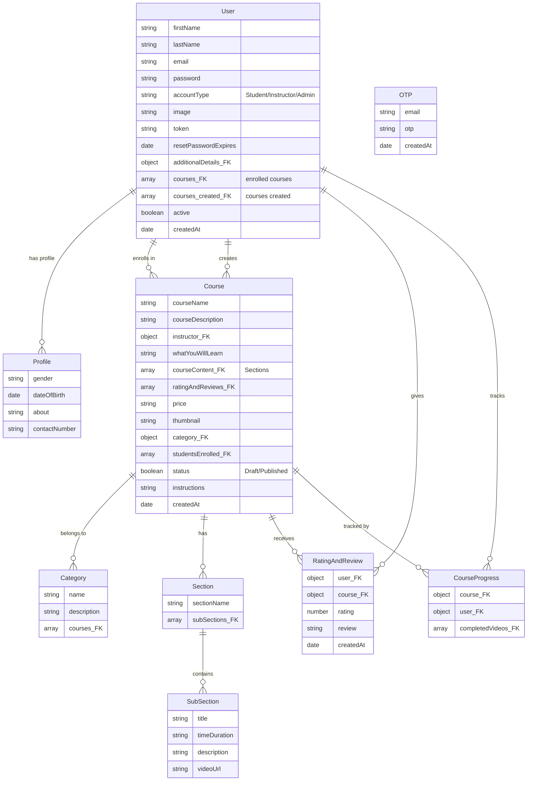

# 🚀 StudyNotion: Your Next-Gen E-Learning Platform

StudyNotion is a cutting-edge, fully-featured online learning management system (LMS) designed to revolutionize the way students learn and instructors teach. From interactive course creation to seamless payment processing and progress tracking, StudyNotion provides a comprehensive and engaging environment for both educators and learners.

## Short Description
StudyNotion is a robust MERN stack e-learning platform that empowers instructors to create and manage courses with rich multimedia content, while offering students an intuitive interface to discover, enroll in, and track their learning journeys. It features secure authentication, payment integration, and a dynamic review system, all built for scalability and performance.

## ✨ Key Features

*   **Comprehensive User Authentication:** Secure signup, login, password reset, and email verification with OTP for both students and instructors.
*   **Dynamic Course Management:** Instructors can effortlessly create, edit, and organize courses into categories, sections, and video subsections, enriched with media uploads via Cloudinary.
*   **Rich Learning Experience:** Students can explore a diverse course catalog, enroll in courses, track their progress, and mark lessons as complete.
*   **Integrated Payment Gateway:** Seamless course purchasing powered by Razorpay, with automated email confirmations.
*   **Interactive Rating & Review System:** Students can provide feedback and ratings, contributing to course quality and informed decisions for others.
*   **Personalized Dashboards:** Dedicated dashboards for students to manage enrolled courses and for instructors to oversee their created courses, earnings, and analytics.
*   **User Profile Management:** Allows users to update profile details, change profile pictures, modify passwords, and manage account settings.
*   **Email Notifications:** Automated email services for course enrollment, password updates, and contact form submissions.
*   **Responsive & Intuitive UI:** A user-friendly interface crafted with React and Tailwind CSS, ensuring a smooth experience across devices.

## Who is this for?
*   **Aspiring Instructors & Educators:** Who want to share their knowledge and build an online course empire with powerful management tools.
*   **E-learning Entrepreneurs:** Looking for a ready-to-deploy, full-stack solution to launch their online academy or educational portal.
*   **Students & Lifelong Learners:** Seeking a structured and interactive platform to acquire new skills and advance their careers.
*   **Developers:** Interested in a modern MERN stack application demonstrating best practices in full-stack development.

## Technology Stack & Architecture

StudyNotion is built on a modern and scalable MERN (MongoDB, Express.js, React, Node.js) stack, enhanced with key third-party integrations:

*   **Frontend:** React.js, Redux Toolkit, Tailwind CSS, React Router DOM
*   **Backend:** Node.js, Express.js
*   **Database:** MongoDB (via Mongoose ORM)
*   **Cloud Services:** Cloudinary (for media storage), Nodemailer (for email services)
*   **Payment Gateway:** Razorpay
*   **Authentication:** JWT (JSON Web Tokens), bcrypt (for password hashing)

## 📊 Architecture & Database Schema

The core of StudyNotion's data management is a well-structured MongoDB schema, designed for flexibility and performance.



## ⚡ Quick Start Guide

To get StudyNotion up and running on your local machine, follow these steps:

1.  **Clone the Repository:**
    ```bash
    git clone https://github.com/grewal16/study_notion.git
    cd study_notion
    ```

2.  **Install Frontend Dependencies:**
    ```bash
    npm install
    # or yarn install
    ```

3.  **Install Backend Dependencies:**
    ```bash
    cd server
    npm install
    # or yarn install
    cd ..
    ```

4.  **Configure Environment Variables:**
    Create a `.env` file in the `server` directory and populate it with your MongoDB URI, Cloudinary credentials, Razorpay keys, JWT secret, and email service (Nodemailer) configurations.

5.  **Start the Backend Server:**
    ```bash
    cd server
    npm run dev
    # or node index.js
    ```

6.  **Start the Frontend Application:**
    ```bash
    cd ..
    npm start
    # or yarn start
    ```
    Your application should now be accessible at `http://localhost:3000`.

## 📜 License
A license file is not present in this repository.
