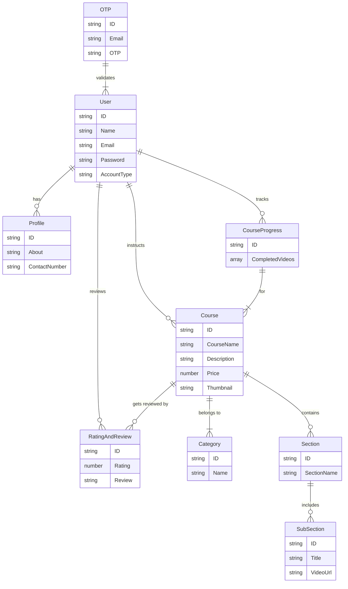

# 🚀 StudyNotion: Your Gateway to Next-Level Learning

<p align="center"></p>

## Short Description

StudyNotion is a cutting-edge, full-stack online learning platform (Learning Management System - LMS) designed to empower both students and instructors. It offers a seamless and interactive educational experience, featuring robust course management, secure payment processing, comprehensive user profiles, and an intuitive interface to foster a dynamic learning environment. From creating engaging course content to tracking student progress and handling secure transactions, StudyNotion provides a complete solution for modern online education.

## ✨ Key Features

*   **Dynamic Course Management:** Instructors can effortlessly create, edit, and publish multi-section, multi-subsection courses, complete with rich media content.
*   **Comprehensive User Authentication:** Secure signup, login, password reset, and email verification, supporting different user roles (Student, Instructor, Admin) for tailored experiences.
*   **Intuitive Dashboard:** Personalized dashboards for students to track enrolled courses and progress, and for instructors to manage their courses, view analytics, and track earnings.
*   **Secure Payment Integration:** Seamless course enrollment and purchase powered by Razorpay, ensuring reliable and secure transactions.
*   **Rich Media Handling:** Integrated with Cloudinary for efficient storage and delivery of video lectures and course thumbnails.
*   **Interactive Learning Path:** Students can mark course sections as complete, track their overall progress, and leave ratings and reviews.
*   **Engaging Frontend Experience:** A responsive and visually appealing user interface built with React and styled with Tailwind CSS, offering a smooth browsing and learning journey.
*   **Robust Backend APIs:** A powerful Node.js/Express.js backend handles all business logic, data persistence, and external service integrations.
*   **Real-time Communication:** Automated email notifications for course enrollment, password updates, and contact form submissions.

## Who is this for?

*   **Aspiring Students:** Looking for a structured and interactive platform to learn new skills and advance their knowledge.
*   **Passionate Instructors:** Seeking an easy-to-use platform to share their expertise, create engaging courses, and reach a global audience.
*   **Educational Institutions:** Wanting to launch or enhance their online learning offerings with a scalable and feature-rich LMS.
*   **Full-Stack Developers:** Interested in a comprehensive example of a modern MERN stack application, featuring authentication, payment gateways, and media management.

## Technology Stack & Architecture

StudyNotion is built on a robust MERN (MongoDB, Express.js, React, Node.js) stack, enhanced with industry-leading third-party services for a scalable and high-performance learning experience.

*   **Frontend:** React.js, React Router DOM, Redux Toolkit, Tailwind CSS, React Hook Form, React-Hot-Toast.
*   **Backend:** Node.js, Express.js, MongoDB (with Mongoose ORM), JSON Web Tokens (JWT) for authentication, Bcrypt for password hashing.
*   **Cloud Services:** Cloudinary (for media management), Razorpay (for payment gateway), Nodemailer (for email services).
*   **Deployment:** Designed for easy deployment to cloud platforms.

## 📊 Architecture & Database Schema

The core architecture of StudyNotion follows a client-server model, with a React frontend communicating with a Node.js/Express.js backend. Data is persistently stored in a MongoDB database, with relationships managed through Mongoose schemas.

The simplified Entity-Relationship Diagram (ERD) below illustrates the key entities and their relationships within the StudyNotion database:



## ⚡ Quick Start Guide

To get StudyNotion up and running on your local machine, follow these steps:

1.  **Clone the Repository:**
    ```bash
    git clone https://github.com/grewal16/study_notion.git
    cd study_notion
    ```

2.  **Install Dependencies:**
    *   **Frontend (Root Directory):**
        ```bash
        npm install
        # OR
        yarn install
        ```
    *   **Backend (Server Directory):**
        ```bash
        cd server
        npm install
        # OR
        yarn install
        cd ..
        ```

3.  **Set Up Environment Variables:**
    Create a `.env` file in the `server` directory and populate it with your credentials:
    ```
    PORT=4000
    MONGO_DB_URL=YOUR_MONGODB_CONNECTION_STRING
    JWT_SECRET=YOUR_JWT_SECRET_KEY
    CLOUDINARY_CLOUD_NAME=YOUR_CLOUDINARY_CLOUD_NAME
    CLOUDINARY_API_KEY=YOUR_CLOUDINARY_API_KEY
    CLOUDINARY_API_SECRET=YOUR_CLOUDINARY_API_SECRET
    MAIL_USER=YOUR_EMAIL_FOR_NODEMAILER
    MAIL_PASS=YOUR_EMAIL_APP_PASSWORD
    RAZORPAY_KEY_ID=YOUR_RAZORPAY_KEY_ID
    RAZORPAY_KEY_SECRET=YOUR_RAZORPAY_KEY_SECRET
    CLIENT_URL=http://localhost:3000
    ```

4.  **Start the Application:**
    *   **Backend Server:**
        ```bash
        cd server
        npm start
        # OR
        node index.js
        cd ..
        ```
    *   **Frontend Development Server:**
        ```bash
        npm start
        # OR
        yarn start
        ```

5.  **Access StudyNotion:**
    Open your browser and navigate to `http://localhost:3000`. You're now ready to explore StudyNotion!