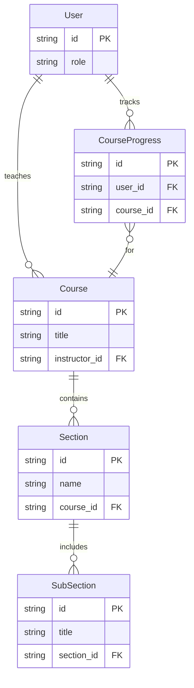

# 🚀 SkillSphere: Your Gateway to Masterful Learning

<p align="center"></p>

[](https://github.com/your-org/SkillSphere/releases)

## Short Description
SkillSphere is a cutting-edge, full-stack MERN (MongoDB, Express.js, React, Node.js) E-learning platform designed to empower both educators and learners. With a robust backend and an intuitive, dynamic frontend, SkillSphere provides a seamless experience for creating, managing, and consuming online courses. From secure authentication to integrated payment gateways and comprehensive course progress tracking, SkillSphere is built to be your ultimate digital classroom.

## ✨ Key Features
*   **Comprehensive Course Management:** Instructors can effortlessly create, update, delete, and publish rich, multi-section courses with embedded subsections and media (powered by Cloudinary).
*   **Secure User Authentication:** Robust user registration, login, profile management, and password reset functionalities, complete with email verification.
*   **Integrated Payment Gateway:** Seamless course enrollment and payment processing via Razorpay, ensuring a smooth transactional experience.
*   **Dynamic Learning Experience:** Students can enroll in courses, track their progress, and leave valuable ratings and reviews.
*   **Multi-Role Dashboard:** Dedicated dashboards for students, instructors, and potentially administrators, tailored to their specific needs and permissions.
*   **Rich User Profiles:** Personalize your learning journey or instructor profile with editable details and profile picture updates.
*   **Interactive Frontend:** A modern, responsive user interface built with React and styled with Tailwind CSS, offering an engaging and accessible experience.
*   **Automated Email Notifications:** Timely email alerts for course enrollment, password updates, payment confirmations, and contact form responses.
*   **Cloud-based Media Storage:** Leverage Cloudinary for efficient and scalable storage of course images and videos.

## Who is this for?
SkillSphere is ideal for:
*   **Aspiring Students:** Those eager to learn new skills, explore diverse subjects, and track their educational journey in an engaging environment.
*   **Passionate Educators:** Instructors and experts looking for a powerful platform to host their courses, manage content, and connect with a global student base.
*   **Educational Institutions:** Organizations seeking a modern, scalable, and feature-rich solution to deliver online education.
*   **Developers:** A fantastic codebase to learn about full-stack MERN development, modern web technologies, and e-learning architecture.

## Technology Stack & Architecture
SkillSphere is engineered with a powerful and popular technology stack, ensuring scalability, performance, and maintainability:

*   **Frontend:**
    *   **React.js:** A declarative, component-based UI library for building dynamic user interfaces.
    *   **Tailwind CSS:** A utility-first CSS framework for rapid and consistent styling.
    *   **Redux Toolkit:** For efficient state management across the application.
*   **Backend:**
    *   **Node.js & Express.js:** A robust and scalable server-side runtime and web application framework.
    *   **MongoDB:** A flexible NoSQL database for storing course content, user data, and more.
    *   **JWT (JSON Web Tokens):** For secure, stateless authentication.
*   **External Services:**
    *   **Razorpay:** Integrated payment gateway for secure transactions.
    *   **Cloudinary:** Cloud-based service for image and video upload, storage, and management.
    *   **Nodemailer:** For sending transactional emails.

## 📊 Architecture & Database Schema
Below is a simplified Entity-Relationship Diagram (ERD) illustrating the core data models and their relationships within SkillSphere, providing a high-level overview of our database design.



## ⚡ Quick Start Guide

To get SkillSphere up and running on your local machine, follow these steps:

1.  **Clone the Repository:**
    ```bash
    git clone https://github.com/your-org/SkillSphere.git
    cd SkillSphere
    ```
    *(Note: Replace `your-org/SkillSphere` with the actual repository path if available.)*

2.  **Install Backend Dependencies:**
    ```bash
    cd server
    npm install
    ```

3.  **Configure Backend Environment Variables:**
    Create a `.env` file in the `server/` directory and add your environment variables. Essential variables typically include:
    *   `MONGO_DB_URL`
    *   `JWT_SECRET`
    *   `CLOUD_NAME`, `API_KEY`, `API_SECRET` (for Cloudinary)
    *   `RAZORPAY_KEY_ID`, `RAZORPAY_KEY_SECRET`
    *   `MAIL_USER`, `MAIL_PASS`

4.  **Start the Backend Server:**
    ```bash
    npm start
    ```
    The server will typically run on `http://localhost:4000`.

5.  **Install Frontend Dependencies:**
    Open a new terminal, navigate back to the root, then into the `src` directory.
    ```bash
    cd ../src
    npm install
    ```

6.  **Configure Frontend Environment Variables (if any):**
    Create a `.env` file in the `src/` directory.

7.  **Start the Frontend Development Server:**
    ```bash
    npm start
    ```
    The React application will typically open in your browser at `http://localhost:3000`.

You are now ready to explore SkillSphere!