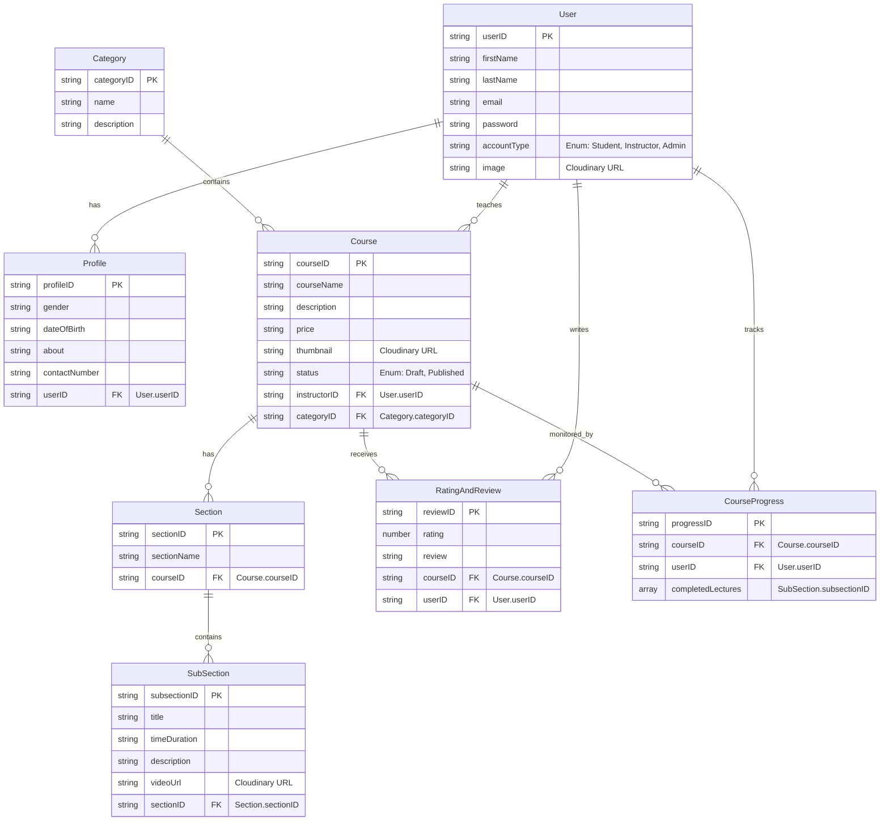

# 🚀 StudyNotion: Your All-in-One E-Learning Powerhouse

<p align="center"></p>

## Short Description
StudyNotion is a cutting-edge, full-stack e-learning platform designed to revolutionize the way knowledge is shared and acquired. Built with the modern web in mind, it provides a seamless and intuitive experience for both instructors to create and manage courses, and students to discover and enroll in them. From robust authentication to integrated payment gateways and comprehensive course management, StudyNotion is your ultimate destination for dynamic online education.

## ✨ Key Features
*   **Dynamic Course Creation & Management:** Instructors can easily add, edit, and organize courses with sections and subsections, including rich media content.
*   **Secure User Authentication:** Comprehensive user registration, login, and password management (reset/update) with email verification and multi-role (Student, Instructor, Admin) authorization.
*   **Intuitive Course Catalog:** Students can browse a vast catalog of courses, explore details, and filter by categories.
*   **Seamless Enrollment & Payments:** Integrated Razorpay for secure and efficient course enrollment and payment processing.
*   **Personalized Dashboards:** Dedicated dashboards for students to track enrolled courses and progress, and for instructors to manage their courses and earnings.
*   **Interactive Rating & Reviews:** Students can rate and review courses, providing valuable feedback for the community.
*   **Profile Management:** Users can update their profile information, including profile pictures with Cloudinary integration for image uploads.
*   **Email Notifications:** Automated email templates for course enrollment, password updates, payment success, and contact form responses.
*   **Progress Tracking:** Students can monitor their course progress, marking lectures as complete.
*   **Responsive Design:** A modern, visually appealing user interface built with React and Tailwind CSS, ensuring a great experience across all devices.

## Who is this for?
*   **Aspiring Instructors & Educators:** Share your expertise with the world by creating and selling engaging online courses.
*   **Eager Learners & Students:** Discover a wide range of subjects, enroll in courses, and enhance your skills at your own pace.
*   **Educational Institutions:** A powerful platform for deploying and managing your online curriculum.
*   **Developers:** A fantastic example of a full-stack MERN application with modern features, perfect for learning or as a foundation for your next project.

## Technology Stack & Architecture
StudyNotion leverages a robust and scalable MERN stack, complemented by essential cloud services for a high-performance, feature-rich experience.

*   **Frontend:**
    *   **React.js:** For building a dynamic and interactive user interface.
    *   **Redux Toolkit:** Efficient state management for a seamless user experience.
    *   **Tailwind CSS:** For highly customizable and utility-first styling.
*   **Backend:**
    *   **Node.js & Express.js:** A powerful and flexible backend for handling API requests and business logic.
    *   **MongoDB:** A NoSQL database for storing structured and unstructured data, managed with Mongoose.
*   **Cloud Services:**
    *   **Cloudinary:** For efficient media management (course thumbnails, profile pictures).
    *   **Razorpay:** Secure and reliable payment gateway integration.
    *   **Nodemailer:** For sending transactional emails (verification, enrollment, password reset).

## 📊 Architecture & Database Schema
StudyNotion's architecture is designed for scalability and maintainability, ensuring a clear separation of concerns between client and server. The database schema facilitates robust course management, user interactions, and progress tracking.



## ⚡ Quick Start Guide

To get StudyNotion up and running on your local machine, follow these steps:

1.  **Clone the Repository:**
    ```bash
    git clone https://github.com/grewal16/study_notion.git
    cd study_notion
    ```

2.  **Install Frontend Dependencies:**
    ```bash
    npm install
    # or yarn install
    ```

3.  **Install Backend Dependencies:**
    ```bash
    cd server
    npm install
    # or yarn install
    cd ..
    ```

4.  **Environment Variables:**
    Create a `.env` file in both the root directory (for frontend) and `server/` directory (for backend). Populate them with necessary credentials for MongoDB, Cloudinary, Razorpay, JWT secret, etc. (Refer to `.env.example` if available in the original repo, or infer from `server/config` files like `cloudinary.js`, `database.js`, `razorpay.js`).

5.  **Run the Backend Server:**
    ```bash
    cd server
    npm start
    # or node index.js
    cd ..
    ```

6.  **Run the Frontend Application:**
    ```bash
    npm start
    # or yarn start
    ```

Your StudyNotion platform should now be accessible in your browser, typically at `http://localhost:3000`.