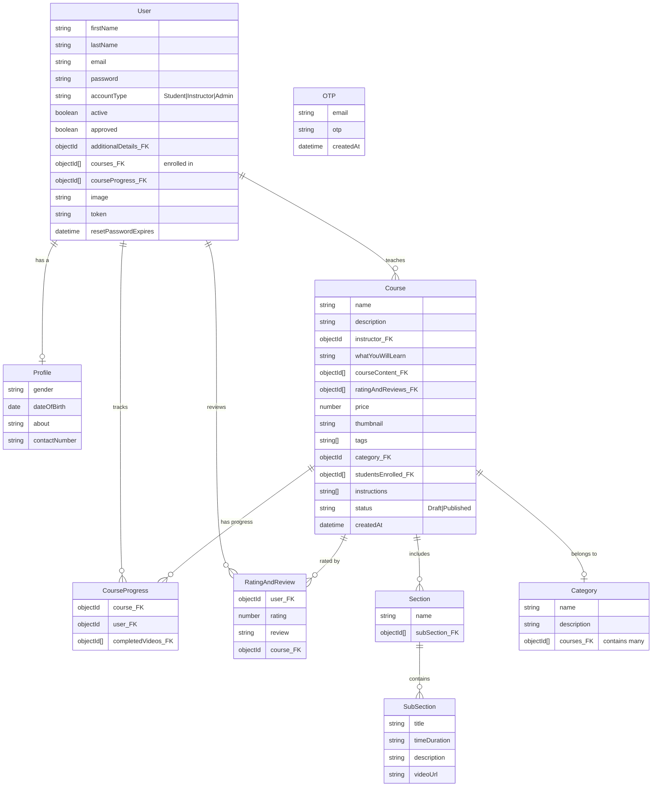

# 🚀 Study Notion

<p align="center"></p>

## Short Description
Study Notion is a cutting-edge, full-stack EdTech platform engineered to revolutionize online learning. It provides a robust, intuitive environment for both educators and learners, facilitating seamless course creation, management, and consumption. With powerful features like secure authentication, integrated payment processing, rich content delivery, and dynamic user roles, Study Notion empowers individuals and institutions to thrive in the digital education landscape.

## ✨ Key Features
*   **Comprehensive Course Management:** Effortlessly create, update, and organize courses with modular sections and interactive subsections, supporting diverse content types including video lectures.
*   **Dynamic User Roles:** Tailored experiences for Students (enroll, track progress, interact), Instructors (create, manage, publish courses, view student analytics), and Admins (overall platform oversight).
*   **Secure Authentication & Authorization:** Robust JWT-based authentication system with OTP verification, secure password reset flows, and granular role-based access control to protect user data and content.
*   **Integrated Payment Gateway:** Seamless and secure course purchasing powered by Razorpay, ensuring a smooth transaction experience for students.
*   **Rich Media Handling:** Efficiently upload and manage all course assets, including high-resolution images and videos, hosted reliably via Cloudinary integration.
*   **Interactive Learning Experience:** Engage learners with features like course progress tracking, student reviews, and a comprehensive rating system to foster a vibrant community.
*   **Responsive & Intuitive Frontend:** Built with React.js and styled with Tailwind CSS, delivering a modern, highly responsive, and engaging user interface across all devices.
*   **Automated Email Notifications:** Keep users informed with automated emails for critical events such as course enrollment, password updates, and contact form submissions.

## Who is this for?
*   **Aspiring Educators & Content Creators:** Instructors seeking a powerful, feature-rich platform to showcase their expertise, create engaging courses, and monetize their knowledge globally.
*   **Eager Learners & Skill Seekers:** Students looking for structured, high-quality online courses with integrated tools for progress tracking, interactive content, and community engagement.
*   **EdTech Visionaries & Entrepreneurs:** Developers and businesses aiming to launch or scale their online learning initiatives with a solid, scalable, and well-architected foundation.

## Technology Stack & Architecture
Study Notion is built upon a modern MERN (MongoDB, Express.js, React.js, Node.js) stack, complemented by industry-leading cloud services to ensure scalability, performance, and a rich user experience.

*   **Frontend:**
    *   **React.js:** A declarative, component-based JavaScript library for building dynamic user interfaces.
    *   **Redux Toolkit:** For efficient state management across the application.
    *   **React Router DOM:** For seamless client-side navigation.
    *   **Tailwind CSS:** A utility-first CSS framework for rapid and responsive UI development.
*   **Backend:**
    *   **Node.js:** A powerful JavaScript runtime for building scalable server-side applications.
    *   **Express.js:** A fast, unopinionated, minimalist web framework for Node.js.
    *   **Mongoose:** An elegant MongoDB object modeling tool for Node.js.
    *   **JWT (JSON Web Tokens):** For secure and stateless authentication.
    *   **bcrypt:** For hashing and securing user passwords.
    *   **Nodemailer:** For sending transactional emails.
    *   **OTP Generation:** For secure email verification and password reset.
*   **Database:**
    *   **MongoDB:** A flexible NoSQL document database, ideal for handling various data structures.
*   **Cloud Services:**
    *   **Cloudinary:** Cloud-based media management service for efficient storage and delivery of images and videos.
    *   **Razorpay:** A leading payment gateway for secure and compliant online transactions.

## 📊 Architecture & Database Schema
This project adopts a layered architecture with distinct frontend and backend components interacting via RESTful APIs. The backend connects to a MongoDB database, leveraging various cloud services for media and payments.

The database schema is designed to support a comprehensive online learning platform:



## ⚡ Quick Start Guide

To get Study Notion up and running on your local machine, follow these steps:

1.  **Clone the Repository:**
    ```bash
    git clone https://github.com/grewal16/study_notion.git
    cd study_notion
    ```

2.  **Install Dependencies:**
    *   **Frontend (React App):**
        ```bash
        npm install
        ```
    *   **Backend (Node.js/Express):**
        ```bash
        cd server
        npm install
        cd ..
        ```

3.  **Environment Variables Setup:**
    Create a `.env` file in both the root directory (for the frontend) and the `server` directory (for the backend).
    *   **`server/.env` (Backend Example):**
        ```
        PORT=4000
        MONGO_URL="mongodb+srv://<username>:<password>@cluster0.abcde.mongodb.net/studynotion?retryWrites=true&w=majority"
        JWT_SECRET="YOUR_JWT_SECRET_KEY"
        CLOUDINARY_CLOUD_NAME="your_cloud_name"
        CLOUDINARY_API_KEY="your_api_key"
        CLOUDINARY_API_SECRET="your_api_secret"
        MAIL_USER="your_email@example.com"
        MAIL_PASS="your_email_app_password"
        RAZORPAY_KEY_ID="rzp_test_yourkeyid"
        RAZORPAY_KEY_SECRET="rzp_test_yourkeysecret"
        ```
    *   **`.env` (Frontend Example - in root, if needed, otherwise handled by proxy):**
        ```
        REACT_APP_BASE_URL="http://localhost:4000/api/v1"
        ```

4.  **Start the Application:**
    *   **Start Backend Server:**
        ```bash
        cd server
        npm start
        ```
    *   **Start Frontend Development Server:**
        ```bash
        cd ..
        npm start
        ```
    Your application should now be running! Open your browser and navigate to `http://localhost:3000` (or the port specified by your frontend).
