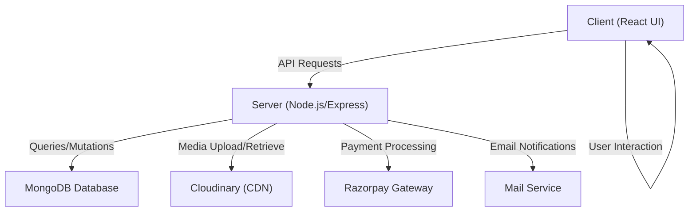

# 🚀 Study Notion: Your Gateway to Next-Gen E-Learning

<p align="center"></p>

## Short Description
Study Notion is a cutting-edge, full-stack online learning platform designed to empower both students and instructors. It offers a comprehensive suite of features for seamless course creation, enrollment, progress tracking, and secure payment processing. Built with a modern tech stack, Study Notion transforms the traditional learning experience into an interactive and engaging digital journey.

## ✨ Key Features
*   **Robust User Authentication & Authorization:** Secure signup, login, password reset, and OTP verification with distinct roles for Students, Instructors, and Admin.
*   **Dynamic Course Management:** Instructors can easily create, update, and manage courses, including sections, sub-sections, and rich media content.
*   **Comprehensive Course Catalog:** A browsable catalog with detailed course descriptions, instructor information, and student ratings/reviews.
*   **Seamless Enrollment & Progress Tracking:** Students can enroll in courses, track their lesson progress, and resume learning exactly where they left off.
*   **Integrated Payment Gateway:** Secure and efficient course purchases powered by Razorpay.
*   **Rich Content Support:** Upload and manage course media (videos, images) effortlessly via Cloudinary integration.
*   **Interactive Rating & Review System:** Students can provide valuable feedback, and instructors can monitor course performance.
*   **Personalized Dashboards:** Tailored dashboards for students to view enrolled courses and progress, and for instructors to manage their offerings and track earnings.
*   **Responsive & Intuitive UI:** A modern, user-friendly interface crafted with React.js and Tailwind CSS for an optimal experience across all devices.
*   **Email Notifications:** Automated emails for course enrollment, password updates, and more, enhancing user communication.

## Who is this for?
*   **Aspiring Students:** Looking for a structured and engaging platform to learn new skills and advance their knowledge.
*   **Expert Instructors:** Seeking a powerful, easy-to-use platform to share their expertise, create online courses, and reach a global audience.
*   **Educational Institutions:** Interested in a customizable solution for offering online courses and managing their academic content.
*   **Developers:** Curious about a full-stack MERN-like application with real-world features like payments, cloud storage, and robust authentication.

## Technology Stack & Architecture
Study Notion leverages a powerful and modern full-stack architecture:

*   **Frontend:**
    *   **React.js:** For building a dynamic and responsive user interface.
    *   **Redux Toolkit:** For efficient state management across the application.
    *   **Tailwind CSS:** For rapid and maintainable styling.
*   **Backend:**
    *   **Node.js & Express.js:** A robust and scalable server-side environment.
    *   **MongoDB:** A flexible NoSQL database for storing application data.
    *   **Mongoose:** ODM for MongoDB to simplify data interaction.
    *   **JWT (JSON Web Tokens):** For secure user authentication and authorization.
    *   **Bcrypt:** For hashing passwords securely.
*   **Cloud Services:**
    *   **Cloudinary:** For efficient cloud-based storage and delivery of course media (images, videos).
    *   **Razorpay:** Integrated payment gateway for secure online transactions.
    *   **Nodemailer:** For sending automated email notifications (e.g., course enrollment, password reset).

## 📊 Architecture & Database Schema

### High-Level Architecture Flow



### Database Schema

Below is the database schema representing the core entities and their relationships within Study Notion.

<p align="center"></p>

## ⚡ Quick Start Guide

To get Study Notion up and running on your local machine, follow these steps:

1.  **Clone the Repository:**
    ```bash
    git clone https://github.com/grewal16/study_notion.git
    cd study_notion
    ```

2.  **Install Frontend Dependencies:**
    ```bash
    npm install
    ```

3.  **Install Backend Dependencies:**
    ```bash
    cd server
    npm install
    cd ..
    ```

4.  **Environment Variables:**
    Create a `.env` file in the `server/` directory and populate it with your configuration:
    ```
    PORT=4000
    MONGO_URL=your_mongodb_connection_string
    JWT_SECRET=your_jwt_secret_key
    CLOUD_NAME=your_cloudinary_cloud_name
    API_KEY=your_cloudinary_api_key
    API_SECRET=your_cloudinary_api_secret
    RAZORPAY_KEY_ID=your_razorpay_key_id
    RAZORPAY_KEY_SECRET=your_razorpay_key_secret
    MAIL_HOST=smtp.ethereal.email # or your mail service host
    MAIL_USER=your_mail_user
    MAIL_PASS=your_mail_password
    ```
    *   **Note:** You'll need to set up accounts with MongoDB Atlas (or local MongoDB), Cloudinary, Razorpay, and an email service (e.g., SendGrid, Nodemailer with Ethereal for testing).

5.  **Start the Backend Server:**
    ```bash
    cd server
    npm start
    ```
    The server will start on `http://localhost:4000` (or your specified PORT).

6.  **Start the Frontend Development Server:**
    ```bash
    cd ..
    npm start
    ```
    The React application will open in your browser, typically at `http://localhost:3000`.

You are now ready to explore Study Notion!