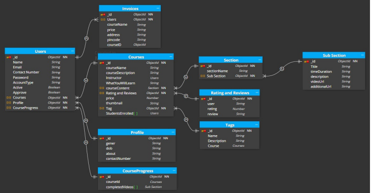

# 🚀 StudyNotion: Your Next-Gen E-Learning Platform

<p align="center"></p>

## Short Description
StudyNotion is a cutting-edge, full-stack e-learning platform designed to empower both students and instructors. It offers a comprehensive suite of features, from secure user authentication and dynamic course creation to integrated payment processing and personalized dashboards. Dive into a world of knowledge with seamless course enrollment, progress tracking, and interactive learning experiences.

## ✨ Key Features
*   **Robust User Authentication & Authorization:** Secure user registration, login, password reset, and email verification. Implements role-based access control for Students, Instructors, and Administrators.
*   **Dynamic Course Management:** Instructors can effortlessly create, edit, and manage courses, sections, and subsections (video lectures). Features include rich text editing, media uploads, and course publishing workflows.
*   **Integrated Payment Gateway:** Streamlined course purchasing experience via Razorpay, complete with secure transactions and automated payment success notifications.
*   **Rich Media Handling:** Leverages Cloudinary for efficient storage and optimized delivery of course thumbnails and video content, ensuring a smooth multimedia experience.
*   **Personalized Dashboards:** Dedicated dashboards for students to track their enrolled courses, monitor progress, and access learning materials. Instructors gain insights into course performance and student engagement.
*   **Rating & Review System:** Students can provide valuable feedback through a comprehensive rating and review system, fostering a community of quality learning.
*   **Comprehensive Profile Management:** Users can update their profiles, change passwords, and manage account settings, including profile picture uploads.
*   **Contact & Support System:** An integrated contact form allows users to reach out for support, with automated email responses to ensure prompt communication.

## Who is this for?
*   **Students & Lifelong Learners:** Discover, enroll in, and master new skills through a vast array of courses tailored to various interests.
*   **Educators & Content Creators:** A powerful platform to share your expertise, build engaging courses, and manage your student base effectively.
*   **E-learning Entrepreneurs:** Launch and scale your online education business with a feature-rich, robust, and extensible platform.
*   **Developers:** An excellent reference for a well-structured MERN stack application, demonstrating best practices in full-stack development.

## Technology Stack & Architecture
StudyNotion is built on a modern and scalable MERN (MongoDB, Express.js, React.js, Node.js) stack, complemented by industry-leading cloud services:

*   **Frontend:**
    *   **React.js:** A declarative, component-based JavaScript library for building dynamic user interfaces.
    *   **Redux Toolkit:** For efficient and predictable state management across the application.
    *   **Tailwind CSS:** A utility-first CSS framework for rapidly building custom designs.
    *   **React Router DOM:** For declarative routing within the single-page application.
*   **Backend:**
    *   **Node.js:** A JavaScript runtime environment for building scalable server-side applications.
    *   **Express.js:** A fast, minimalist web framework for Node.js, providing a robust API layer.
    *   **MongoDB:** A flexible NoSQL database for storing application data.
    *   **Mongoose ODM:** An elegant MongoDB object modeling tool for Node.js.
*   **Cloud Services:**
    *   **Cloudinary:** Cloud-based media management platform for uploading, storing, and delivering images and videos.
    *   **Razorpay:** A robust payment gateway for processing online transactions.
    *   **Nodemailer:** Module for Node.js to send emails, integrated for various notifications (e.g., enrollment, password reset).
*   **Authentication:** JWT (JSON Web Tokens) for secure, stateless authentication.

## 📊 Architecture & Database Schema
To provide a clear understanding of StudyNotion's underlying structure, please refer to the visual diagrams below:

<p align="center"></p>
<p align="center"></p>

## ⚡ Quick Start Guide
Follow these steps to get StudyNotion up and running on your local machine:

1.  **Clone the Repository:**
    ```bash
    git clone https://github.com/grewal16/study_notion.git
    cd study_notion
    ```

2.  **Setup Backend (Server):**
    ```bash
    cd server
    npm install
    ```
    Create a `.env` file in the `server` directory and configure your environment variables (e.g., `MONGODB_URL`, `JWT_SECRET`, `CLOUDINARY_CLOUD_NAME`, `RAZORPAY_KEY_ID`, `MAIL_USER`, `MAIL_PASS`).
    ```bash
    npm start
    ```

3.  **Setup Frontend (Client):**
    ```bash
    cd .. # Go back to the root directory
    npm install
    ```
    Create a `.env` file in the root directory (if needed for frontend-specific variables, e.g., `REACT_APP_BASE_URL` for your backend API).
    ```bash
    npm start
    ```

Your StudyNotion application should now be running!
